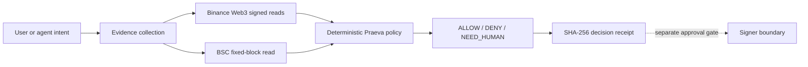

# Judge guide: Praeva by Dyplux

Brand updated: 2026-10-06. Evidence last verified: 2026-10-05. Scope: October 2026 BNB Tokenized Stocks submission. Canonical owner/source: [frozen claims](docs/submission/frozen-claims-2026-10-05.md) and [Monday findings](experiments/EXP-RWA-004/monday-findings.md). Supersedes: none. Status: CURRENT.

**Praeva by Dyplux** is the final product brand. Earlier dated artifacts may refer to **Dyplux Execution Safety Layer**; the frozen claims and original evidence retain their historical wording.

## 60 seconds

Praeva verifies whether an autonomous tokenized-equity agent has enough evidence to sign, and fails closed when it doesn't. It returns `ALLOW`, `DENY` or `NEED_HUMAN` with reason codes and a SHA-256 receipt.

Open the [public judge page](https://dyplux.github.io/bnb-tokenized-stocks-2026/). Inspect the **observed NVDAB NEED_HUMAN** case and its [JSON receipt](docs/judge/observed-unsafe.json), then the **observed mandate DENY** case and its [JSON receipt](docs/judge/observed-mandate-deny.json). Follow [receipt verification](#verify-a-receipt). The green ALLOW example is a **synthetic policy fixture**.

## 3 minutes

[Watch the current 60-second evidence film](https://dyplux.github.io/bnb-tokenized-stocks-2026/media/execution-safety-judge-demo.mp4). It is the public fallback, not the final submission film. The observed cases are dated read-only API decisions. No purchase was signed or broadcast.

An AI agent may propose an intent. The deterministic policy controls the decision and has no private signing key. The present product stops before the signer boundary.

| Built with | Product purpose | Code path | Observed proof |
|---|---|---|---|
| Binance Web3 RWA Data | Token, market and price evidence | [safety service](app/safety_service.py) | [signed response repros](docs/devex/2026-10-04-evidence-summary.md) |
| Binance Web3 Trading API | Amount-specific route check | [safety service](app/safety_service.py) | [route fixture](docs/devex/repros/2026-10-04-rwa-swap-route.md) |
| Transaction build and simulation | Exact-wallet unsigned preflight | [packet script](scripts/prepare_pre_execution_packet.py) | [linked packet](docs/product/pre-execution-packet-linked-2026-10-04.json), predicted failure |
| BNB Smart Chain RPC and bStock | Fixed-block multiplier check | [safety service](app/safety_service.py) | [multiplier audit](experiments/EXP-RWA-011/onchain_multiplier_audit.json) |
| Ondo | Separate representation and market evidence | [safety service](app/safety_service.py) | [matched-ticker audit](experiments/EXP-RWA-010/results.json) |
| Praeva policy and receipt | Fail-closed verdict and hash | [policy](app/rwa_policy.py) | [observed cases](docs/submission/safety-judge-run.md) |

Four actionable DevEx findings: [undocumented `offhours`](docs/devex/repros/2026-10-04-market-status-enum.md), [100-address request HTTP 414](docs/devex/repros/2026-10-04-rwa-price-url-limit.md), [RFQ/SWAP wording inconsistency](docs/devex/repros/2026-10-04-rwa-swap-route.md), and [no independent underlying reference clock in inspected fields](docs/devex/repros/2026-10-04-independent-reference-clock.md). The [DevEx summary](docs/devex/2026-10-04-evidence-summary.md) separates API observations from Dyplux bugs.

## 15 minutes

Follow the [clean-start judge instructions](docs/submission/safety-judge-run.md) with Python 3.9+. The public replay and unit tests need no API secret; a fresh signed review needs the judge's own Binance Web3 key. Run `python3 -m unittest discover -s tests -q`. Inspect the [policy](app/rwa_policy.py), [quote/build/simulation packet](docs/product/pre-execution-packet-linked-2026-10-04.json), [fixed-block multiplier audit](experiments/EXP-RWA-011/onchain_multiplier_audit.json), [Monday preregistration](experiments/EXP-RWA-004/monday-open-protocol.md) and [negative result](experiments/EXP-RWA-004/monday-findings.md).

The [competitive positioning](docs/product/competitive-positioning.md) compares Praeva's narrow RWA evidence task with adjacent product categories. It doesn't claim universal novelty.

### Verify a receipt

For a downloaded receipt JSON, remove `receipt_sha256`, serialize the remaining object with sorted keys, compact separators and UTF-8, then SHA-256 hash those bytes. This is the exact algorithm in [rwa_policy.py](app/rwa_policy.py). A hash proves the receipt hasn't changed under that canonicalization; it doesn't certify the upstream API, eligibility or execution.

### Claim boundary

**Real:** signed RWA and Trading reads, routes, fixed-block RPC, unsigned builds, unsuccessful unfunded simulation predictions, observed `NEED_HUMAN` and mandate `DENY`.

**Synthetic:** the green `ALLOW` fixture and corporate-action regression fixtures.

**Not claimed:** real ALLOW, verified individual holder eligibility, funded passing simulation, signed/broadcast trade, predictive alpha, Agent Studio or Agentic Wallet deployment. The [Monday benchmark](experiments/EXP-RWA-004/monday-findings.md) classified the off-hours hypothesis `SAFETY_ONLY`.

The research claim set was frozen on 5 October. The final submitted artifact hasn't been frozen: `SUBMISSION_SHA` and `SUBMISSION_TAG` remain pending.
