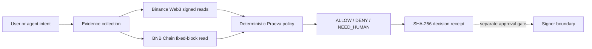

# Judge guide: Praeva by Dyplux

Brand updated: 2026-10-06. Dated evidence continuation: 2026-10-08. Scope: October 2026 BNB Tokenized Stocks submission. Canonical owner/source: [current claims](docs/submission/claims-2026-10-08.md), [frozen research claims](docs/submission/frozen-claims-2026-10-05.md) and [Monday findings](experiments/EXP-RWA-004/monday-findings.md). Supersedes: none. Status: CURRENT.

**Praeva by Dyplux** is the final product brand. Earlier dated artifacts may refer to **Dyplux Execution Safety Layer**; the frozen claims and original evidence retain their historical wording.

## 60 seconds

Praeva is a deterministic RWA evidence-sufficiency and authorization review immediately before a separate privileged signer. It returns `ALLOW`, `DENY` or `NEED_HUMAN` with reason codes and a SHA-256 receipt.

Open the [assessment console](https://praeva.dyplux.com/console/). Select **Observed NEED_HUMAN**, **Observed DENY** or **Synthetic ALLOW**; each keeps its origin, dates, verdict and receipt visible. The managed replay uses captured remote proof, the SPYon denial is a real historical preflight, and ALLOW is synthetic. The [Praeva website](https://praeva.dyplux.com) remains the product entry point. The [GitHub Pages judge packet](https://dyplux.github.io/bnb-tokenized-stocks-2026/) remains available as fallback. Inspect the **observed NVDAB NEED_HUMAN** case and its [JSON receipt](docs/judge/observed-unsafe.json), then the **observed mandate DENY** case and its [JSON receipt](docs/judge/observed-mandate-deny.json). Follow [receipt verification](#verify-a-receipt). The ALLOW example is a **synthetic policy fixture**.

## 3 minutes

[Watch the current 120-second founder-selected evidence film](https://praeva.dyplux.com/media/praeva-bnb-hack-final-v2.mp4). The historical [63-second film](https://praeva.dyplux.com/media/praeva-bnb-hack-final.mp4) and original [60-second film](https://dyplux.github.io/bnb-tokenized-stocks-2026/media/execution-safety-judge-demo.mp4) remain preserved. The observed cases are dated read-only API decisions. No purchase was signed or broadcast.



An AI agent may propose an intent. The deterministic policy controls the decision and has no private signing key. The present product stops before the signer boundary.

| Built with | Product purpose | Code path | Observed proof |
|---|---|---|---|
| Binance Web3 RWA Data | Token, market and price evidence | [safety service](app/safety_service.py) | [signed response repros](docs/devex/2026-10-04-evidence-summary.md) |
| Binance Web3 Trading API | Amount-specific route check | [safety service](app/safety_service.py) | [route fixture](docs/devex/repros/2026-10-04-rwa-swap-route.md) |
| Transaction build and simulation | Exact-wallet unsigned preflight | [packet script](scripts/prepare_pre_execution_packet.py) | [linked packet](docs/product/pre-execution-packet-linked-2026-10-04.json), predicted failure |
| BNB Smart Chain RPC and bStock | Fixed-block multiplier check | [safety service](app/safety_service.py) | [multiplier audit](experiments/EXP-RWA-011/onchain_multiplier_audit.json) |
| Ondo | Separate representation and market evidence | [safety service](app/safety_service.py) | [matched-ticker audit](experiments/EXP-RWA-010/results.json) |
| Praeva policy and receipt | Fail-closed verdict and hash | [policy](app/rwa_policy.py) | [observed cases](docs/submission/safety-judge-run.md) |

Four actionable DevEx findings: [undocumented `offhours`](docs/devex/repros/2026-10-04-market-status-enum.md), [100-address request HTTP 414](docs/devex/repros/2026-10-04-rwa-price-url-limit.md), [RFQ/SWAP wording inconsistency](docs/devex/repros/2026-10-04-rwa-swap-route.md), and [no independent underlying reference clock in inspected fields](docs/devex/repros/2026-10-04-independent-reference-clock.md). The [DevEx summary](docs/devex/2026-10-04-evidence-summary.md) separates API observations from Dyplux bugs.

## Agent Studio and one-shot credit-payment proof

Open the [compact Studio evidence guide](docs/submission/agent-studio-evidence.md). It links ERC-8004 Agent ID **2574 on chain 97**, the [stable card](https://agent.praeva.dyplux.com/.well-known/agent-card.json), three dated managed requests, receipt parity and the [one 1 U x402 settlement](https://bscscan.com/tx/0xb0344256c2807a7ce5d888738048bf74d326bd816b007f6df0a06004506b415b).

Authenticated provider evidence attributed **USD 1 account credit** to that same transaction. On 8 October, one founder-authorized allocation changed key `0` to `1`; the account still showed `1`, and the semantics are unknown. The original runtime's HTTP wait aborted and it later exited through OOM, so same-process continuity isn't proven. A new wallet-free recovery at 08:11 UTC on 9 October returned the canonical receipt, but explanation was unavailable, usage was `0` before and after, no retry occurred, and secrets were removed. Paid inference and full self-funding remain unproven.

The managed trial expires **9 October 18:48:44 UTC** and currently declares OAuth for requests. The stored console case needs no credentials. A separate VPS fallback has its own backend label and parity proof; verify the actual scheduled switch and active stable card through judging.

## 15 minutes

Follow the [clean-start judge instructions](docs/submission/safety-judge-run.md) with Python 3.9+. The public replay and unit tests need no API secret; a fresh signed review needs the judge's own Binance Web3 key. Run `python3 -m unittest discover -s tests -q`. Inspect the [policy](app/rwa_policy.py), [quote/build/simulation packet](docs/product/pre-execution-packet-linked-2026-10-04.json), [fixed-block multiplier audit](experiments/EXP-RWA-011/onchain_multiplier_audit.json), [Monday preregistration](experiments/EXP-RWA-004/monday-open-protocol.md) and [negative result](experiments/EXP-RWA-004/monday-findings.md).

The [competitive positioning](docs/product/competitive-positioning.md) compares Praeva's narrow RWA evidence task with adjacent product categories. It doesn't claim universal novelty.

### Verify a receipt

Run from the repository root with Python 3.9+ and no API key or network request:

```sh
python3 scripts/verify_receipt.py docs/judge/observed-unsafe.json
python3 scripts/verify_receipt.py docs/judge/observed-unsafe.json --expected-sha256 63c918049dc88ab90faef38f9b749be3993884989ec38bb253f5c2b887ae54db
```

`INTEGRITY_MATCH` checks canonical consistency; it isn't authenticity. An externally trusted expected hash pins the compared bytes. An edited receipt with a recomputed embedded hash doesn't prove origin. `REPLAY_MATCH` uses the unchanged same policy kernel at the saved timestamp; it isn't an independently implemented policy. Missing saved context returns `REPLAY_UNAVAILABLE`, without reconstructed inputs. Integrity and replay are printed separately.

Exit 0 means match or an explicitly reported integrity-only/unavailable replay. Exit 2 means invalid receipt, 3 means mismatch, and 4 means unsupported policy version. Inspect the reported states as well as the exit code.

For a downloaded receipt JSON, remove `receipt_sha256`, serialize the remaining object with sorted keys, compact separators and UTF-8, then SHA-256 hash those bytes. This is the exact algorithm in [rwa_policy.py](app/rwa_policy.py). A match shows canonical byte integrity against the compared hash. A modified receipt can be rehashed; origin isn't established without an externally trusted expected hash. It doesn't certify the upstream API, eligibility or execution.

### Claim boundary

**PROVEN:** signed RWA/Trading reads, fixed-block multiplier, observed NEED_HUMAN/DENY, testnet identity, dated managed replay/parity, one autonomous x402 settlement and provider account credit.

**PARTIAL:** settlement and account credit are proven. A separate allocation reported USD 1 key credit; the new wallet-free recovery returned no paid explanation. The complete self-funding loop remains unproven.

**SYNTHETIC:** ALLOW and corporate-action regression fixtures.

**NOT CLAIMED:** stock-token purchase, real purchase ALLOW, passing funded SPYon swap simulation, predictive alpha, paid B402 seller, Agentic Wallet, paid inference/explanation, the complete self-funding loop or original same-process continuity. The [Monday benchmark](experiments/EXP-RWA-004/monday-findings.md) remains SAFETY_ONLY.

The original 5 October research claim set stays frozen. New deployment and credit-payment evidence is dated separately. The 120-second v2 is public and the founder confirmed DevEx submission. The final submission SHA/tag, project-form confirmation and scheduled fallback verification remain pending.

### Dated external-reference limits

The [8 October availability note](docs/submission/external-link-qa-2026-10-08.md) identifies historical third-party 404 references, explorer access restrictions and the bounded anonymous check scope. Those restrictions don't replace the retained onchain receipt or policy-hash verification. Final public rollout QA remains separate.

## Evidence sufficiency and authority

A route can exist while authority to sign remains unproven. `NEED_HUMAN` is a first-class result: required evidence or authorization prerequisites are unresolved, so a human must resolve them before a separate signer may act. It doesn't authorize a trade. `DENY` records a policy violation; the demonstrated `ALLOW` is synthetic.

Covenant / StockGuard overlap exists. Praeva's strongest distinction in this build is evidence sufficiency, provenance, freshness and authorization prerequisites before a separate signer. The receipt doesn't cryptographically enforce that signer's behavior or certify universal tokenized-stock safety.

Follow the [dated proof matrix](docs/submission/proof-matrix-2026-10-08.md): proposed action, route exists, evidence checked, evidence missing, NEED_HUMAN, receipt, verification. The linked 8 October Studio package records the chain through USD 1 provider account credit. The later allocation and unsuccessful 9 October recovery are dated separately above.

## Wallet Skills dated addition, 9 October

[Official Wallet Skills read-only proof](docs/submission/wallet-skills-evidence-2026-10-09.md) records Ondo NVDAon public reads followed by NEED_HUMAN from the unchanged kernel. Run `python3 experiments/EXP-WALLET-SKILLS-001/verify_proof.py` without credentials or network. No Agentic Wallet execution or stock-token trade is claimed. The video and Studio packet retain their earlier dates.
