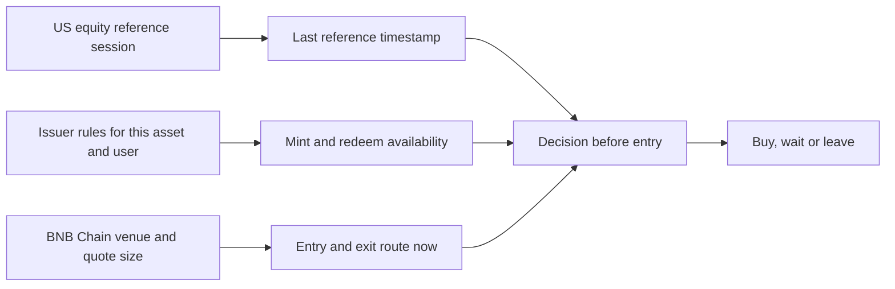

# CEO brief: what changes when the reference market closes?

**Checked:** 2026-10-03 UTC. **Decision state:** one active read-only build hypothesis under [D-048](../decisions/decision-log.md), with user demand and eligibility unproved. **Deadline:** 2026-10-11 at 12:00 UTC ([event](https://www.bnbchain.org/en/hackathons/tokenized-stocks)). This note is internal research, not a trading claim.

## The market event, without the shortcut

The [event page](https://www.bnbchain.org/en/hackathons/tokenized-stocks) opens with Friday 4pm New York and a stock reference that freezes while tokenized stocks continue trading. [Nasdaq's market-hours page](https://www.nasdaq.com/market-activity) shows regular trading ending at 4pm ET and after-hours trading continuing until 8pm ET. The relevant clock depends on the chosen reference feed and asset. We must display the last reference timestamp rather than assume every price freezes at 4pm.

Trading outside the regular session is real. [Binance reported](https://www.binance.com/en/blog/markets/8716450413672266850) that roughly **44% of bStocks volume was outside regular US market hours as of 30 June 2026**, citing Binance Research. This is a platform-reported volume share with no independent reproduction here. It establishes activity in the period, not user pain, execution quality or an edge. Our [ten-weekend check](2026-10-01-weekend-crypto-equity-task.md) found no compelling next-hour lead in the tested Spot CEX series. Those series aren't executable BNB Chain quotes.

The [official Binance tokenized-securities skill](https://github.com/binance/binance-skills-hub/blob/main/skills/binance-web3/binance-tokenized-securities-info/SKILL.md) warns that an RWA `volume24h` field refers to US stock trading volume, not on-chain DEX volume. It also describes a changing shares multiplier. A dashboard that labels either field incorrectly would make the market look larger or the reference spread look different than it is. These are implementation checks, not a standalone product idea.

The branches are separate. [Ondo announced](https://ondo.finance/blog/real-24-7-trading-for-tokenized-stocks) that six named assets, including NVDAon, have 24/7 minting and redemption for eligible users from 25 June 2026; the rest generally had 24/5 issuer access. [Yostocks' public DX log](https://github.com/yostocks-protocol/yostocks/blob/main/DX_LOG.md) reports one NVDAon sell quote failing with `316008` while its buy quote worked and status said `TRADING`. That is a competitor's single, router-specific observation. It doesn't contradict the issuer's direct 24/7 claim: issuer access and a particular router's exit route can differ. We need our own repeated quotes before generalizing.

## The user decision

The narrow user is a person with a small stablecoin balance in a self-custodied BNB Chain wallet, no Binance exchange account, looking at a specific tokenized stock outside regular hours. They want to know: **If I enter with 5 USDC, can this route return an exit quote now, for approximately the acquired size, and what known costs or restrictions remain?** A useful answer may be “wait”: a cheap entry without a usable exit doesn't offer the flexibility that 24/7 branding suggests.

This is a hypothesis about a decision, not demonstrated demand. The [3 October two-way quote](2026-10-03-usdc-nvdab-roundtrip-quote.md) proves the Binance Web3 API returned estimates for a zero-balance address. It doesn't prove fill, eligibility, all-in cost or later resale. The founder's budget is about EUR 10, so the experiment must stay small if a funded task is ever authorized.

## What others already cover

| Substitute | Observed or claimed capability | Remaining question |
|---|---|---|
| [PancakeSwap Stocks](https://pancakeswap.finance/stocks) | Our 3 October browser visit showed asset discovery, 11 NVIDIA issuers and Trade actions. A jurisdiction confirmation appeared before the 5 USDC task could finish. | Does its live quote path show the same-size inverse exit and full costs before buying? Unverified behind that gate. |
| [Yostocks](https://github.com/yostocks-protocol/yostocks) | Its public README and DX log describe buy/sell execution and quote guards. [Pinned code review](2026-10-03-same-task-substitute-check.md) found the reviewed buy path omits the inverse exit; the sell path requires a positive holding. | The code-level difference is specific; its bot wasn't invoked and user demand remains unproved. |
| [Ondo](https://ondo.finance/ondo-stocks) and [Binance](https://www.binance.com/en/blog/markets/8716450413672266850) | Issuer and exchange products have 24/7 features for eligible users. | Which features can a self-custodial founder actually use in their region and venue? Exchange-account conversion isn't their route. |
| [Robinhood](https://robinhood.com/us/en/newsroom/hood-summit-2026/) | Its 24 Hour Market reaches Friday 8pm ET; on 29 September it announced future weekend equities trading. | Its user access and chain route differ, and the weekend advantage may shrink. |

An issuer access conflict needs attention. [Ondo's current eligibility page](https://docs.ondo.finance/ondo-stocks/eligibility) lists an EEA issuer-onboarding requirement of Professional Client or Qualified Investor. [Ondo's Binance launch post](https://ondo.finance/blog/tokenized-stocks-live-on-binance) describes EEA retail access through a product channel. These may concern different entities or routes. We haven't resolved that distinction for this founder's wallet, so neither page authorizes a purchase. [Binance's bStocks page](https://www.binance.com/en/blog/markets/8716450413672266850) also limits access to eligible users in permitted jurisdictions. Use the exact issuer and venue terms before a funded demo. This is an access check, not a legal conclusion.

The [Venus governance forum](https://community.venus.io/t/bnb-chain-apro-onboarding-core-pool-oracle-updates/5901) has a measured after-hours oracle-divergence case for bStock collateral, including a reported SPCXB breach of its 5% pivot twice. That supports a different lending-risk workflow. Our EUR 10 solo task can't demonstrate it well, so it stays out of this product.

## Candidate product and disproof

**Conditional lead:** a pre-entry ticket for one exact BNB Chain stock token and amount. It shows the entry estimate, immediate inverse exit estimate or a failed route, timestamps, source, issuer/contract, and cost fields with unknowns labelled. It ends in `ROUTE AVAILABLE`, `ROUTE UNAVAILABLE` or `COST INCOMPLETE`, never a profit recommendation. The API path is RWA identity/status plus Trading quotes, and Transaction simulation only if a selected execution flow needs it.

**Kill the idea if** either closest substitute already gives the same decision for the same amount before purchase, or we can't find a permitted asset/route for a credible small demonstration. A missing inverse quote is a product result only if we can tell route failure apart from our integration error. A stale reference alone isn't a trade signal.

## CEO gate, with no waiting period

The founder rejected calendar-style staging. [D-048](../decisions/decision-log.md) approves an immediate read-only build under a [one-page spec](../product/pre-entry-exit-spec.md). Finish the entry and inverse exit path first, review its actual provider responses and closest substitutes next, then prepare judge access and a factual DX report. If the task is already solved by an incumbent or no eligible route can be shown, retire the claim. The only fixed time is the official submission lock on **11 October at 12:00 UTC**.

No wallet funding, trade, public repo or production deploy follows from this memo. Those actions require a concrete review. The product repo stays separate from Bell.
