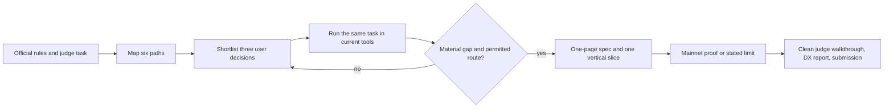
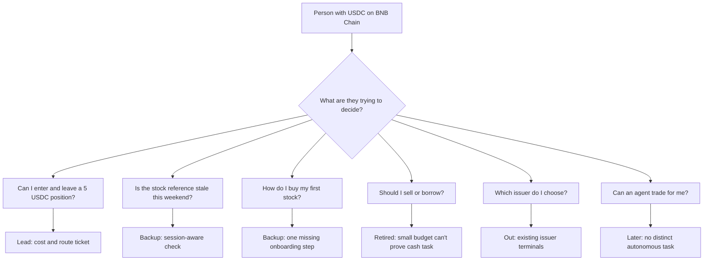

# Tokenized stocks: product paths and submission sprint

**Date:** 2026-10-03 UTC. **Owner:** Dyplux. **State:** decision aid, not a final product claim.

## The event sets the outside boundary

The [official event page](https://www.bnbchain.org/en/hackathons/tokenized-stocks), checked 2026-10-03, closes submissions on **11 October at 12:00 UTC**. It accepts solo builders and asks for a working project built on at least one Binance Web3 API module. At least one of bStocks, Ondo or xStocks must be central; the main track is BNB Chain mainnet spot. The page calls for a public repository, a deployed link or judge instructions, and a factual Developer Experience Report. Its weights are technical implementation 30%, originality 25%, Developer Experience Report 25% and product quality/UX 20%. The page recommends a video of up to four minutes and a small live mainnet demonstration. A quote-only integration might meet the minimum but would have limited technical depth; that is our inference, not an extra event rule. The submission form needs a separate final check because its fields may be stricter than the overview.

The founder can't use a Binance exchange account. This project must work through a self-custodied BNB Chain wallet and the separately issued Binance Web3 API. A returned quote doesn't establish issuer eligibility, executable output or profit. The founder's planned demo budget is around EUR 10; existing wallet keys must stay as chosen. No funding or trade is authorised by this document.

The [3 October CEO source audit](2026-10-03-market-close-ceo-brief.md) refines the event premise: Nasdaq has an after-hours session to 8pm ET, Ondo has six eligible-user assets with 24/7 direct redemption, and one builder reports a router-specific NVDAon sell failure despite a buy quote. These facts point to an asset-, route- and amount-specific exit check, not a blanket claim that references or redemptions stop at Friday 4pm. The [source method](SOURCE-METHOD.md) records how developer-forum leads are accepted or rejected.

## The professional loop for this sprint

The local operating manual and Dyplux method call for the same sequence: start at the judging task, map substitutes, test one user decision, then build the smallest complete path. [Y Combinator's idea and user research material](https://www.ycombinator.com/blog/startup-school-week-1-recap-kevin-hale-and-eric-migicovsky/) treats an idea as a hypothesis and asks what the user last tried, what was hard and what current solutions miss. We won't claim an interview happened when none did. **Our evidence rule:** a founder-operated task can show technical function and some UX behavior; it can't show independent demand. The event permits solo teams and doesn't require an external test user.



The missed step so far was **B to D**. We documented many API details and safety gates without showing the founder a compact choice of products. We also treated an independent holder session as though the event required it. The event doesn't. We still need honest evidence for the task we claim to solve.

## Six paths, three investigated



| Path | User decision | Existing substitute or evidence | Solo demo with about EUR 10 | Current call |
|---|---|---|---|---|
| **A. Exit before entry** | "If I buy 5 USDC of this tokenized stock, can I get a current exit quote, and what costs remain?" | [Two-way 5 USDC NVDAB quote](2026-10-03-usdc-nvdab-roundtrip-quote.md) worked on 3 October from a zero-balance temporary address. Both returned estimates, with no fill or known all-in cost. [PancakeSwap's stock terminal](https://blog.pancakeswap.finance/articles/pancakeswap-your-go-to-guide-to-trade-rwas) and [yostocks](https://github.com/yostocks-protocol/yostocks) already offer trade flows. Whether either solves this exact decision remains untested in their live UI. | Unknown until issuer eligibility, minimum output, allowance, gas and funding fit the budget. Read-only proof is available. | **Lead, conditional** |
| **B. Weekend reference check** | "Is this quote based on a current stock reference, and is a real exit route open now?" | The event names the closed-market/open-chain mismatch. [OneTicker](https://github.com/JemIIahh/oneticker), [NightDesk](https://github.com/PhiBao/nightdesk) and Binance's [stock trading guide](https://developers.binance.com/en/docs/products/agentic-wallet/use-cases/trading/stock-trading) cover parts of this task. Our [ten-weekend check](2026-10-01-weekend-crypto-equity-task.md) did not establish a predictive edge. | Yes for observation; no profit claim. | Backup if A is already solved |
| **C. First self-custodial purchase** | "Can I buy a small tokenized equity without a Binance exchange account or confusing wallet steps?" | [PancakeSwap](https://blog.pancakeswap.finance/articles/pancakeswap-your-go-to-guide-to-trade-rwas), [yostocks](https://github.com/yostocks-protocol/yostocks) and [Binance's onramp](https://developers.binance.com/en/docs/products/connect-2.0/buy-any-token/1.buy-any-token) already address purchase. We haven't observed a failed first purchase in the current flows. | Possible but funding/onramp and eligibility still unknown. | Backup if one concrete stuck step appears |
| D. Sell or borrow against bStock | "How do I raise cash while keeping the exposure?" | [Steward's live borrow view](2026-10-03-steward-live-swipe-same-task.md) exists. Our EUR 10 budget can't reproduce the 100 USDT cash task or personal loan risk. | No convincing matched demo. | Retired under [D-045](../decisions/decision-log.md) |
| E. Multi-issuer comparison | "Which token with this ticker should I choose?" | [PancakeSwap](https://blog.pancakeswap.finance/articles/pancakeswap-your-go-to-guide-to-trade-rwas) and Binance [Stock Hub](https://www.binance.com/en/support/announcement/detail/32e7cb9ac92d42e3850a7de415013bbe) already show issuer choices. | Yes, but weak differentiation. | Out |
| F. Autonomous trading agent / Agent Studio | "Can a rule watch and execute for me?" | The [event](https://www.bnbchain.org/en/hackathons/tokenized-stocks) offers a Studio special prize, but its criteria ask for deep identity, runtime and x402 use. No distinct autonomous buyer task is observed. | Too much integration before the main task works. | Later only if the user task demands it |

## Provisional shortlist score

Ratings are internal judgement from 0 to 5, **not** event scores or measured demand. Weights come from the local operating manual: task severity/frequency 20%, evidence 20%, event fit 15%, demo 15%, differentiation 10%, feasibility 10%, future advantage 10%. Every score can change after a same-task walkthrough.

| Path | Task | Evidence | Event | Demo | Difference | Feasible | Future | Weighted / 5 | Why it isn't settled |
|---|---:|---:|---:|---:|---:|---:|---:|---:|---|
| A. Exit before entry | 3 | 2 | 5 | 4 | 2 | 4 | 2 | **3.15** | We have quotes, but no observed user struggle or live incumbent comparison. |
| C. First purchase | 3 | 2 | 5 | 4 | 1 | 3 | 2 | **2.95** | Incumbents offer purchase; the missing step hasn't been observed. |
| B. Weekend reference | 3 | 2 | 5 | 3 | 1 | 4 | 2 | **2.90** | Session awareness is crowded; the measured lead did not support alpha. |

**Recommendation:** spend one bounded discovery session on A. The proposed output is a small, dated **entry and exit decision ticket**: amount, exact token identity, current entry quote, immediate inverse exit estimate, quote age, known fees, unknown costs, and a clear route-available or route-unavailable result. Don't call the estimate a guaranteed resale amount or calculate break-even until fee units, minimum outputs, slippage and gas support it. The user may decide that a tiny trade isn't worth opening. This saves avoidable cost; it doesn't promise a profitable trade.

Proposed first screen, showing fields rather than fabricated values:

```text
I have: 5 USDC                    I want: tokenized NVDA
Issuer and contract: [resolved from current RWA data]

If I enter now                 If I tried to leave now
Token amount: [entry quote]    USDC back: [inverse quote or unavailable]
Quote received: [time]         Quote received: [time]

Costs we can account for: [itemized amount and unit]
Costs still missing: [gas / approval / slippage / issuer access]

Decision: ROUTE AVAILABLE / ROUTE UNAVAILABLE / COST INCOMPLETE
Next step: [refresh quote / choose another asset / inspect wallet]
```

The inverse quote is an estimate made before any purchase. A positive difference between two quotes isn't profit. The screen must keep that boundary visible and never turn `COST INCOMPLETE` into a buy recommendation.

**Kill condition:** if PancakeSwap or the closest hackathon entrant already presents a same-amount exit estimate and total entry/exit costs clearly before buying, A has no material gap. Switch to B or C only if the same-task review shows a specific failure those products leave unresolved. If a live competing interface remains inaccessible, use its current public documentation and label the gap **unverified**; A may proceed as a bounded prototype because it has a measured two-way quote, without claiming originality or user demand. If issuer eligibility remains unconfirmed, don't buy that issuer's token for the demo. Use another permitted asset only after checking its terms. A missing eligible token blocks a funded demo, not a read-only prototype or a candid submission.

### First live substitute observation

At about 18:45 UTC on 3 October, an unauthenticated Chrome session opened [PancakeSwap Stocks](https://pancakeswap.finance/stocks). The page returned HTTP 200 and visibly listed stock references, quote prices, volume, multiple issuers per ticker and a Trade action. The observed table listed NVIDIA with 11 issuers. This confirms a working discovery surface, so a stock catalog isn't our product. This browser session didn't reach a same-size entry quote, inverse exit quote, connected wallet or cost summary. We can't call the exit-cost gap open or closed from that observation.

## Execute without calendar waits

[D-048](../decisions/decision-log.md) supersedes the intermediate dates above. Start the approved [one-page spec](../product/pre-entry-exit-spec.md) immediately. Each completed action unlocks the next one:

| Action now | Output needed to continue |
|---|---|
| Build the 5 USDC read-only entry and inverse exit path | One working local screen with signed Binance Web3 quotes, timestamps and distinct failure states |
| Review the actual response and closest substitutes | Correct any field or route claim that the evidence doesn't support; retire the hypothesis if an incumbent already answers it |
| Prepare a small mainnet demonstration only if issuer access and costs pass | A concrete amount, transaction simulation, loss ceiling and founder-controlled wallet review before any funds move |
| Make the repo accessible, prepare the DX report and short video | Judge can reproduce the exact built flow; every public claim has a dated source |
| Submit | Form receipt before the official **11 October, 12:00 UTC** lock |

**Decision owner:** Dyplux. The founder doesn't need to find another holder or use a Binance exchange account. No intermediate date is a reason to wait; legal access and actual wallet actions remain separate gates.

## What remains unknown

1. Whether the selected token's issuer permits the founder's jurisdiction and self-custodial purchase. An API quote isn't an eligibility check.
2. Whether a live first-party interface already shows the whole entry/exit cost decision.
3. Gas, approval, minimum received and eventual sell availability for the same controlled wallet and time. Our [3 October quote record](2026-10-03-usdc-nvdab-roundtrip-quote.md) contains estimates from a zero-balance temporary address only.
4. Independent user demand. We can submit a solo-built tool with honest technical evidence; we can't claim traction or a proven money-making edge.
